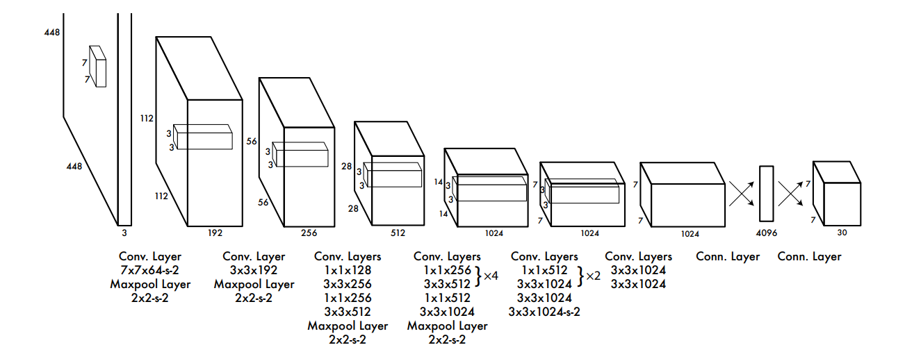
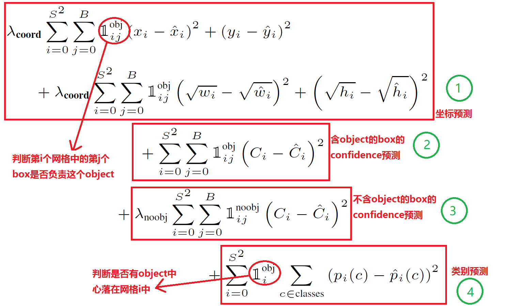

# keras-yolo (YOLO v1)
This repository presents a quick and simple implementation of YOLO v1 object detection using Keras library with Tensorflow backend.
- keras 2.2.4
- Tensorflow 1.12.0

## Introduction to object detection
。。。                                          |

In this project, we will use YOLO v1, since it's easy to implement and are reasonably fast.

## The YOLO v1

### Architecture of the convolutional neural network

The YOLO v1 is consist of 24 convolution layers and 3 full connected layers. Each convolution layer consists of convolution, leaky relu and max pooling operations. The first 24 convolution layers can be understood as the feature extractor, whereas the last three full connected layers can be understood as the "regression head" that predicts the bounding boxes.



the detail of the architecture is in list in this table
- Layers	        Parameters
- Input Data	    Images Size: 448×448
- Convolution	    num_filters: 64, kernel size: 7×7, stride: 2​
- Max Pooling	    kernel size: 2×2, stride: 2
- Convolution	    num_filters: 192, kernel size: 3×3, stride: 1
- Max Pooling	    kernel size: 2×2, stride: 2
- Convolution	    num_filters: 128, kernel size: 1×1, stride: 1
- Convolution	    num_filters: 256, kernel size: 3×3, stride: 1
- Convolution	    num_filters: 256, kernel size: 1×1, stride: 1
- Convolution	    num_filters: 512, kernel size: 3×3, stride: 1
- Max Pooling	    kernel size: 2×2, stride: 2
- Convolution	    num_filters: 256, kernel size: 1×1, stride: 1
- Convolution	    num_filters: 512, kernel size: 3×3, stride: 1
- Convolution	    num_filters: 256, kernel size: 1×1, stride: 1
- Convolution	    num_filters: 512, kernel size: 3×3, stride: 1
- Convolution	    num_filters: 256, kernel size: 1×1, stride: 1
- Convolution	    num_filters: 512, kernel size: 3×3, stride: 1
- Convolution	    num_filters: 256, kernel size: 1×1, stride: 1
- Convolution	    num_filters: 512, kernel size: 3×3, stride: 1
- Convolution	    num_filters: 512, kernel size: 1×1, stride: 1
- Convolution	    num_filters: 1024, kernel size: 3×3, stride: 1
- Max Pooling	    kernel size: 2×2, stride: 2  
- Convolution	    num_filters: 512, kernel size: 1×1, stride: 1
- Convolution	    num_filters: 1024, kernel size: 3×3, stride: 1
- Convolution	    num_filters: 512, kernel size: 1×1, stride: 1
- Convolution	    num_filters: 1024, kernel size: 3×3, stride: 1
- Convolution	    num_filters: 1024, kernel size: 3×3, stride: 1
- Convolution	    num_filters: 1024, kernel size: 3×3, stride: 2
- Convolution	    num_filters: 1024, kernel size: 3×3, stride: 1
- Convolution	    num_filters: 1024, kernel size: 3×3, stride: 1
- Flatten
- Fully Connected Layer	    Input Number: 1024, Output Number: 512
- Fully Connected Layer	    Input Number: 512, Output Number: 4096
- Fully Connected Layer	    Input Number: 4096, Output Number: 7×7×30


### Loss


In this project, we will use Keras to construct the YOLO model.

### Postprocessing

The output of this network is a 1470 vector, which contains the information for the predicted bounding boxes. The information is organized in the following way


The 1470 vector output is divided into three parts, giving the probability, confidence and box coordinates. Each of these three parts is also further divided into 49 small regions, corresponding to the predictions at each cell. In postprocessing steps, we take this 1470 vector output from the network to generate the boxes that with a probability higher than a certain threshold. The detail of these steps are in the `yolo_net_out_to_car_boxes` function in the `utili` class.

### Use pretrained weights

```
load_weights(model,'./yolo.weights')
```

Note that tensorflow is used for the backend in this project.

## Results

The following shows the results for several test images with a threshold of 0.17. We can see that the cars are detected:


[Here](https://www.youtube.com/watch?v=PncSIx8AHTs) is the result of applying the same pipeline to a video.

## Discussion

## Reference

1. J. Redmon, S. Divvala, R. Girshick, and A. Farhadi, You Only Look Once: Unified, Real-Time Object Detection, arXiv:1506.02640 (2015).
2. J. Redmon and A. Farhadi, YOLO9000: Better, Faster, Stronger, arXiv:1612.08242 (2016).
3. darkflow, https://github.com/thtrieu/darkflow
4. Darknet.keras, https://github.com/sunshineatnoon/Darknet.keras/
5. YAD2K, https://github.com/allanzelener/YAD2K

